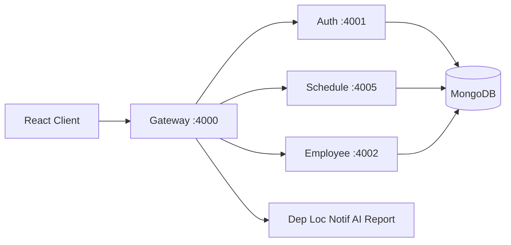

# 01 — סקירת המערכת

## מה זה See You Tomorrow?

מערכת **SaaS** לתיאום עבודה היברידית: נוכחות במשרד/מהבית, מחלקות, מיקומים, חניה, חדרי ישיבות, התראות בזמן אמת, והמלצות AI (רק אחרי אישור admin).

## למי המערכת מיועדת

- **ארגונים** — חברות שמנהלות עובדים במשרד ובבית
- **מנהלים** — לוחות, העדפות צוות, דוחות
- **עובדים** — יומן אישי, העדפות נוכחות, פרופיל

## תפקידים (Roles)

| תפקיד | הרשאות עיקריות |
|--------|-----------------|
| **admin** | גישה מלאה: עובדים, מחלקות, מיקומים, חוקי שיבוץ, AI, הגדרות ארגון |
| **manager** | מחלקה שלו: לוחות, העדפות, דוחות, חניה (במסגרת מחלקה) |
| **employee** | לוח אישי, העדפות, פרופיל, חדרי ישיבות |

הגדרה: [`server/shared/src/types/roles.ts`](../server/shared/src/types/roles.ts)

## מצבי פריסה

### Single-tenant (ברירת מחדל)

- deployment אחד, `.env` ללא `TENANT_DB_PREFIX`
- DBs: `syt_employees`, `syt_schedules`, ...
- מתאים: ארגון בודד, dev מקומי

### Multi-tenant SaaS

- **חברה = instance + subdomain + DB prefix**
- DBs: `acme_syt_employees`, `beta_syt_employees`, ...
- registry מרכזי: `syt_platform`
- פירוט: [04-database-and-saas.md](04-database-and-saas.md), [07-saas-tenants.md](07-saas-tenants.md)

## תרשים כללי

## Tech Stack (תמצית)

| שכבה | טכנולוגיות |
|------|------------|
| Frontend | React, TypeScript, MUI, Vite, RTL/עברית, React Query, Socket.IO client |
| Backend | Node.js, Express, TypeScript, MongoDB, JWT, BullMQ, Redis |
| DevOps | Docker Compose, npm workspaces |

## משתמש קצה vs מפתח

משתמש קצה **לא** מריץ פקודות מה-repo — נכנס דרך הדפדפן לכתובת שהוקצתה לו (למשל `acme.yourdomain.com`).

מפתחים מריצים `npm run dev`, Docker, seed — ראו [05-running-locally.md](05-running-locally.md).

---

## English Summary

**See You Tomorrow** is a hybrid workforce coordination SaaS: schedules, departments, locations, parking, meeting rooms, real-time notifications, and AI recommendations (admin-approved only). Three roles exist: admin, manager, and employee. The system can run as a single tenant (default `syt_*` databases) or as multi-tenant SaaS with per-company DB prefixes (`acme_syt_*`). End users access the app via browser; developers run the stack locally or in Docker as documented in the other files in this folder.
