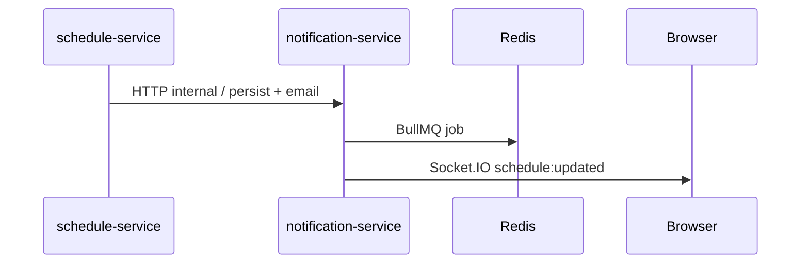

# 02 — ארכיטקטורה

## עקרון: Microservices + API Gateway

הדפדפן מדבר **רק** עם ה-Gateway. כל שירות אחראי על domain משלו ומתחבר ל-MongoDB (או proxy HTTP לשירותים אחרים).

## שירותים ופורטים

| שירות | פורט | תפקיד |
|--------|------|--------|
| Gateway | 4000 | Proxy, rate limit, WebSocket |
| auth-service | 4001 | Login, register, JWT, reset password |
| employee-service | 4002 | עובדים, CSV import |
| department-service | 4003 | מחלקות |
| location-service | 4004 | מיקומים, חניה, חדרי ישיבות |
| schedule-service | 4005 | לוחות, חוקים, העדפות, org settings |
| notification-service | 4006 | התראות, email, Socket.IO |
| ai-recommendation-service | 4007 | המלצות AI, assistant chat |
| report-service | 4008 | דוחות (proxy לשירותים) |
| Client (Vite) | 5173 | React SPA |

## Gateway — מיפוי routes

מקור: [`server/gateway/src/index.ts`](../server/gateway/src/index.ts)

| נתיב Gateway | שירות יעד |
|--------------|-----------|
| `/api/auth` | auth-service |
| `/api/employees` | employee-service |
| `/api/departments` | department-service |
| `/api/locations`, `/api/parking`, `/api/meeting-rooms` | location-service |
| `/api/schedules` | schedule-service |
| `/api/notifications` | notification-service |
| `/api/ai` | ai-recommendation-service |
| `/api/reports` | report-service |
| `/socket.io` | notification-service (WebSocket) |

### מצב central (SaaS)

כש-`GATEWAY_MODE=central`: login/register/forgot/reset מנותבים ל-auth של tenant לפי email/domain/slug; `/api/platform/*` לזיהוי tenant.

## אימות והרשאות

1. **JWT** — access token (ברירת מחדל 15 דק') + refresh token
2. **Payload:** `{ sub, email, role }` — ללא tenant id (tenant מרומז מה-instance/subdomain)
3. **Validation** — בכל שירות מוגן: `requireAuth` + `requireRoles` / RBAC
4. **שירות-לשירות** — header `x-internal-secret` ([`internalAuth.ts`](../server/shared/src/middleware/internalAuth.ts))

## MongoDB — bounded contexts

7 databases לוגיים per tenant (ראו [04-database-and-saas.md](04-database-and-saas.md)):

- `syt_auth`, `syt_employees`, `syt_departments`, `syt_locations`, `syt_schedules`, `syt_notifications`, `syt_settings`

Shared library: [`server/shared/`](../server/shared/)

## Redis + BullMQ

| שימוש | שירות |
|--------|--------|
| תור מיילים | notification-service |
| preference → AI pipeline (debounce) | schedule-service |

נדרש `REDIS_URL`. ב-dev: `npm run docker:deps`.

## זרימת התראות

## Monorepo

npm workspaces ב-[`package.json`](../package.json): `client`, `server/shared`, gateway, כל service.

Build משותף: `npm run build -w @syt/shared` לפני שירותים.

---

## English Summary

The app uses a **microservices architecture** behind an **API Gateway** (port 4000). Nine backend services handle auth, employees, departments, locations, schedules, notifications, AI, and reports. JWT auth is validated per service; inter-service calls use `INTERNAL_SERVICE_SECRET`. MongoDB is split into seven logical databases per tenant. Redis powers BullMQ for email queues and the preference-AI pipeline. The React client only talks to the gateway; WebSocket `/socket.io` proxies to notification-service.
