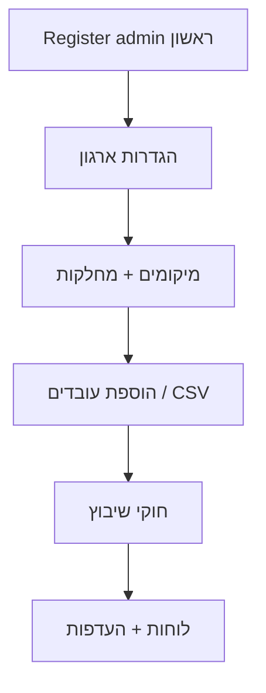

# 03 — מודולים וזרימות

## מפת מסכים (Frontend)

מקור routes: [`client/src/App.tsx`](../client/src/App.tsx)

### ציבורי (ללא login)

| מסך | נתיב |
|-----|------|
| דף בית | `/` |
| אודות | `/about` |
| תמחור | `/pricing` |
| התחברות | `/login` |
| callback (SaaS central) | `/login/callback` |
| הרשמה | `/register` |
| שכחתי סיסמה | `/forgot-password` |
| איפוס סיסמה | `/reset-password` |

### מוגן (אחרי login)

| מסך | נתיב | הרשאה |
|-----|------|--------|
| לוח בקרה | `/dashboard` | manager / admin |
| יומן | `/calendar`, `/calendar/month/:ym` | כולם |
| חדרי ישיבות | `/meeting-rooms` | כולם |
| עובדים | `/employees` | admin |
| מחלקות | `/departments` | admin |
| מיקומים | `/locations` | admin |
| חוקי שיבוץ | `/scheduling-rules` | admin |
| ניהול לוחות | `/schedules` | manager / admin |
| העדפות צוות | `/team-preferences` | manager / admin |
| תור AI העדפות | `/preference-ai-queue` | manager / admin |
| חניה | `/parking` | manager / admin |
| דוחות | `/reports` | manager / admin |
| המלצות AI | `/ai-recommendations` | manager / admin |
| התראות | `/notifications` | כולם |
| העדפות אישיות | `/my-preferences` | employee |
| פרופיל | `/profile` | כולם |
| הגדרות ארגון | `/settings` | כולם (קריאה); עריכה admin |

---

## מודול 1: אימות (Auth)

**שירות:** auth-service  
**API:** `/api/auth/*`

| פעולה | Endpoint |
|--------|----------|
| הרשמה | `POST /api/auth/register` |
| התחברות | `POST /api/auth/login` |
| יציאה | `POST /api/auth/logout` |
| רענון token | `POST /api/auth/refresh` |
| פרופיל | `GET /api/auth/me` |
| שכחתי סיסמה | `POST /api/auth/forgot-password` |
| איפוס סיסמה | `POST /api/auth/reset-password` |

**Bootstrap:** המשתמש הראשון ב-DB ריק → `admin`. ב-production: `ALLOW_PUBLIC_REGISTER` או DB ריק.

**SaaS:** אופציונלי `tenantSlug`, `inviteToken` ב-body; central gateway מנתב ל-auth של tenant.

---

## מודול 2: עובדים (Employees)

**שירות:** employee-service  
**API:** `/api/employees/*`

- CRUD עובדים (admin)
- רשימה scoped: manager/employee רואים מחלקה שלהם
- **ייבוא CSV** — admin, merge לפי email
- `isActive=false` → חסימת login, revoke tokens, ניקוי לוחות עתידיים

---

## מודול 3: מחלקות (Departments)

**שירות:** department-service  
**API:** `/api/departments/*`

- מבנה ארגוני, קישור ל-location ו-manager
- admin בלבד לניהול

---

## מודול 4: מיקומים (Locations)

**שירות:** location-service  
**API:** `/api/locations/*`

- אתרים/משרדים, קיבולת
- admin לניהול

---

## מודול 5: לוחות ויומן (Schedules)

**שירות:** schedule-service  
**API:** `/api/schedules/*`

- שיבוצים יומיים (office / home / leave / custom statuses)
- יומן 7/15 ימים, חודש מלא
- **חוקי שיבוץ** — admin
- **העדפות נוכחות** — employee מגיש; manager/admin מאשרים pipeline
- **הגדרות ארגון** — singleton per tenant (`OrganizationSettings`)

**הרשאות:** [`scheduleAuthz.ts`](../server/services/schedule-service/src/services/scheduleAuthz.ts)

- admin — הכל
- manager — מחלקה שלו
- employee — רק עצמו

---

## מודול 6: חניה וחדרי ישיבות

**שירות:** location-service  
**API:** `/api/parking/*`, `/api/meeting-rooms/*`

- חניות לפי location, הזמנות
- חדרי ישיבות והזמנות
- הרשאות write: employee — עצמו; manager — מחלקה

---

## מודול 7: התראות

**שירות:** notification-service  
**API:** `/api/notifications/*`, Socket.IO

- התראות in-app per user
- מייל (SMTP / MailHog ב-dev)
- אירועים: `schedule:updated`, `notification:new`, `dashboard:refresh`

---

## מודול 8: AI

**שירות:** ai-recommendation-service  
**API:** `/api/ai/*`

- המלצות שיבוץ — **לא** מוחלות אוטומטית
- admin מאשר: `POST /api/ai/approve-recommendations`
- Assistant chat (Anthropic Claude) — אופציונלי

---

## מודול 9: דוחות

**שירות:** report-service  
**API:** `/api/reports/*`

- aggregation מ-schedule, employee, location, notification
- PDF/email דרך notification-service

---

## זרימת onboarding ארגון חדש

---

## English Summary

The application is organized into modules: **auth**, **employees**, **departments**, **locations**, **schedules/calendar**, **parking/meeting rooms**, **notifications**, **AI recommendations**, and **reports**. Each maps to UI routes in `App.tsx` and API paths proxied by the gateway. Authorization follows three roles (admin, manager, employee) with department-scoped access for managers and employees on sensitive data like schedules. AI changes never auto-apply; admins must approve recommendations.
