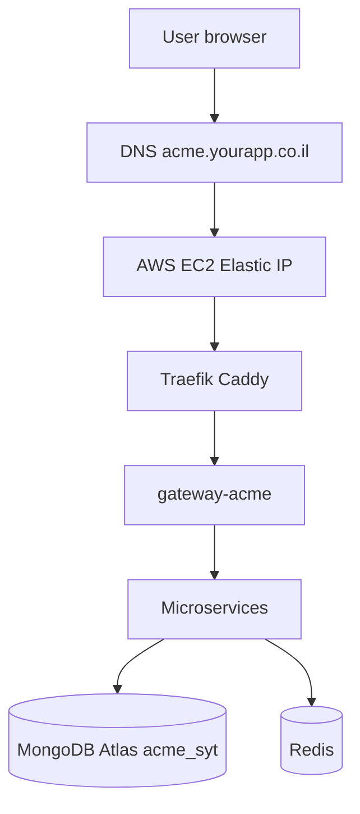

# 08 — Production, DNS ו-AWS

## סקירה

מדריך **outline** — לא מדריך AWS מלא. לפרטי tenants ראו [07-saas-tenants.md](07-saas-tenants.md).

## שלב 1 — דומיין

- רכישת דומיין (למשל `yourapp.co.il`)
- DNS: Route53 (AWS) או Cloudflare / רשם

## שלב 2 — שרת AWS

| רכיב | המלצה |
|------|--------|
| Compute | EC2 (Docker) או ECS |
| IP קבוע | **Elastic IP** — קשר ל-instance |
| Firewall | Security Group: 80, 443, 22 (SSH מוגבל) |

## שלב 3 — חיבור DNS לשרver

| סוג | שם (Host) | ערך |
|-----|-----------|-----|
| A | `@` | Elastic IP |
| A | `acme` | Elastic IP |
| A | `beta` | Elastic IP |
| A | `*` | Elastic IP (wildcard — אופציונלי) |

**בדיקה:**

```bash
dig acme.yourapp.co.il
nslookup acme.yourapp.co.il
```

Propagation: דקות עד 48 שעות.

## שלב 4 — Reverse proxy + SSL

על השרserver:

- **Traefik** (ב-[`deploy/docker-compose.platform.yml`](../deploy/docker-compose.platform.yml))
- או **Caddy** ([`deploy/Caddyfile`](../deploy/Caddyfile))

SSL: Let's Encrypt אוטומטי (Traefik/Caddy).

```
acme.yourapp.co.il  →  gateway-acme:4000
beta.yourapp.co.il  →  gateway-beta:4000
```

## שלב 5 — MongoDB ו-Redis

| שירות | המלצה production |
|--------|-------------------|
| MongoDB | **MongoDB Atlas** (managed, backup) |
| Redis | ElastiCache / Redis Cloud |

עדכן `MONGO_URI`, `REDIS_URL` ב-compose/env.

## שלב 6 — Client (Frontend)

- `npm run build -w @syt/client`
- הגש static files: S3+CloudFront, Nginx, או אותו Caddy
- `VITE_API_BASE` — ריק אם same-origin; או URL gateway

## שלב 7 — Secrets

- `JWT_SECRET` — ארוך ואקראי
- `INTERNAL_SERVICE_SECRET` — שונה מ-JWT
- API keys (OpenAI, Anthropic) — רק server, לא Vite client
- **אל** commit `.env` ל-Git

## שלב 8 — tenants

לכל לקוח: [checklist ב-07](07-saas-tenants.md).

## תרשים



## Checklist עליה

- [ ] דומיין + DNS
- [ ] EC2 + Elastic IP + Security Group
- [ ] Docker + compose platform
- [ ] Atlas + Redis
- [ ] tenant ראשון provision + compose up
- [ ] HTTPS עובד
- [ ] register admin + smoke test
- [ ] SMTP production
- [ ] `NODE_ENV=production`
- [ ] גיבוי Mongo

---

## English Summary

Production deployment outline: buy a domain, run Docker on AWS EC2 with an Elastic IP, point DNS A records (per subdomain or wildcard) to that IP, and use Traefik or Caddy for HTTPS and routing to per-tenant gateway containers. Use MongoDB Atlas and managed Redis. Build and serve the React client separately or via the same proxy. Configure strong secrets and follow the tenant provisioning checklist in document 07 for each customer.
